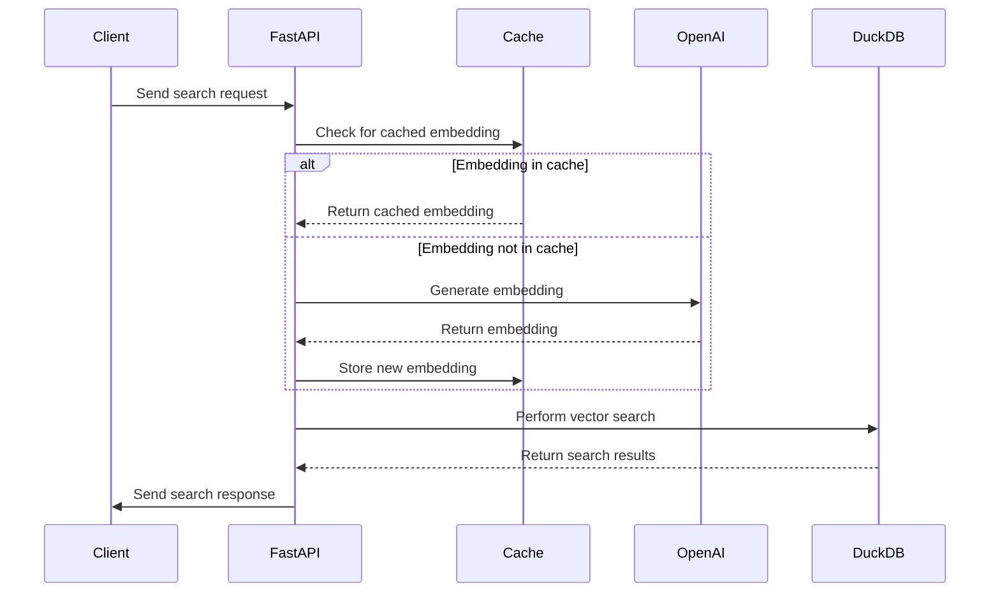

# DVS - DuckDB Vector Similarity Search API

A high-performance vector similarity search API powered by DuckDB and OpenAI embeddings.

## Overview

DVS (DuckDB-VSS-API) is a FastAPI-based web service that provides efficient vector similarity search capabilities using DuckDB as the backend database and OpenAI's embedding models for vector representation. This project is designed for applications requiring fast similarity search capabilities, such as recommendation systems, semantic search engines, and content discovery platforms.

## Key Features

- Single and bulk vector similarity searches
- Caching of embeddings for improved performance
- Support for both text queries and pre-computed vector embeddings
- Configurable search parameters (e.g., top-k results, embedding inclusion)
- Integration with OpenAI's latest embedding models

## Architecture



## Installation

1. Install from PyPI:
   ```shell
   pip install dvs-py
   ```

## Usage

### Usage in API Server

1. Start the FastAPI server:
   ```shell
   make run-server-dev
   ```

2. Access the API documentation:
   Open your browser and navigate to `http://localhost:8000/docs` for the Swagger UI.

3. Make API requests:
   - Single search: `POST /search` or `POST /s`
   - Bulk search: `POST /bulk_search` or `POST /bs`

```python
import base64

import numpy as np
import openai
import requests
from rich import print

# Query text search
response = requests.post(
    "http://localhost:8000/search",
    json={"query": "AMD yes!", "top_k": 3},
)
print(response.json())
# {
#     'results': [
#         {
#             'point': {
#                 'point_id': 'pt-bac54213-f476-4fb0-9813-24492135ad85',
#                 'document_id': 'doc-18610658-cf88-4a53-b2ac-7e47e16465a5',
#                 'content_md5': '1fc96c3d1916da4075947eb136673c16',
#                 'embedding': [],
#                 'metadata': {}
#             },
#             'document': {
#                 'document_id': 'doc-18610658-cf88-4a53-b2ac-7e47e16465a5',
#                 'name': '348.txt',
#                 'content': 'Game makers get Xbox 2 sneak peek...',
#                 'content_md5': '1fc96c3d1916da4075947eb136673c16',
#                 'metadata': {'file': '348.txt', 'content_length': 2589},
#                 'created_at': 1733371367,
#                 'updated_at': 1733371367
#             },
#             'relevance_score': 0.31964972615242004
#         },
#         {
#             'point': {
#                 'point_id': 'pt-7bcba958-ce5b-4d0d-b9d4-7b4fe4ec77cd',
#                 'document_id': 'doc-de784541-a0fa-430b-9376-44bbbec8ccd4',
#                 'content_md5': '878e78314cc8e162642b3d9028c6e0d2',
#                 'embedding': [],
#                 'metadata': {}
#             },
#             'document': {
#                 'document_id': 'doc-de784541-a0fa-430b-9376-44bbbec8ccd4',
#                 'name': '329.txt',
#                 'content': 'Intel unveils laser breakthrough...',
#                 'content_md5': '878e78314cc8e162642b3d9028c6e0d2',
#                 'metadata': {'file': '329.txt', 'content_length': 2883},
#                 'created_at': 1733371367,
#                 'updated_at': 1733371367
#             },
#             'relevance_score': 0.3183119297027588
#         },
#         {
#             'point': {
#                 'point_id': 'pt-a0032c53-362a-4caf-8db7-ed1559450e8f',
#                 'document_id': 'doc-cc036752-b5e7-4729-85c7-dc09a3f18d34',
#                 'content_md5': '5bf7dc32f230d0f427faec2ae3aa5b48',
#                 'embedding': [],
#                 'metadata': {}
#             },
#             'document': {
#                 'document_id': 'doc-cc036752-b5e7-4729-85c7-dc09a3f18d34',
#                 'name': '019.txt',
#                 'content': 'Intel unveils laser breakthrough...',
#                 'content_md5': '5bf7dc32f230d0f427faec2ae3aa5b48',
#                 'metadata': {'file': '019.txt', 'content_length': 2875},
#                 'created_at': 1733371367,
#                 'updated_at': 1733371367
#             },
#             'relevance_score': 0.31670358777046204
#         }
#     ]
# }


# Query array search
vector = (
    openai.OpenAI()
    .embeddings.create(
        input="Play Nintendo Switch", model="text-embedding-3-small", dimensions=512
    )
    .data[0]
    .embedding
)
response = requests.post(
    "http://localhost:8000/search",
    json={"query": vector},
)
print(response.json())


# Query array in base64
vector = (
    openai.OpenAI()
    .embeddings.create(
        input="IBM is a company", model="text-embedding-3-small", dimensions=512
    )
    .data[0]
    .embedding
)
vector_base64 = base64.b64encode(np.array(vector, dtype=np.float32).tobytes()).decode(
    "ascii"
)
response = requests.post(
    "http://localhost:8000/search",
    json={"query": vector_base64},
)
print(response.json())

# Bulk search
response = requests.post(
    "http://localhost:8000/bulk_search",
    json={"queries": [{"query": "PlayStation 2"}, {"query": "Xbox 360"}]},
)
print(response.json())
# {"results": [{"results": [...]}, {"results": [...]}]}
```

## License

This project is licensed under the MIT License. See the [LICENSE](LICENSE) file for details.

## Contributing

Contributions are welcome! Please feel free to submit a Pull Request.
