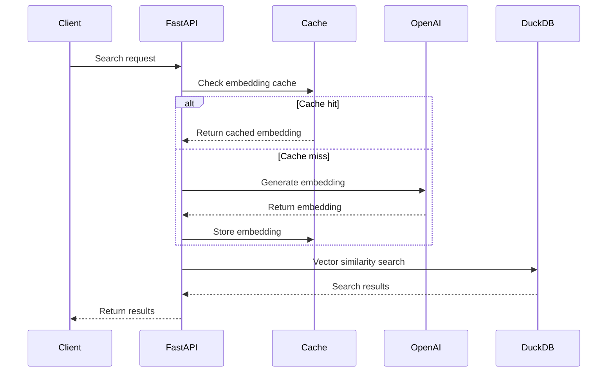

# DVS - DuckDB Vector Similarity Search API

[](https://badge.fury.io/py/dvs-py)
[](https://www.python.org/downloads/)
[](https://opensource.org/licenses/MIT)

A high-performance vector similarity search API powered by DuckDB and OpenAI embeddings.

## 🚀 Features

- **Fast Vector Search**: Efficient similarity search using DuckDB's vector capabilities
- **OpenAI Integration**: Automatic embedding generation with OpenAI models
- **Caching**: Built-in embedding cache for improved performance
- **Flexible API**: Support for text queries, pre-computed vectors, and bulk operations
- **Easy Setup**: Simple installation and configuration

## 📚 Documentation

- **Documentation**: [https://allen2c.github.io/dvs/](https://allen2c.github.io/dvs/)
- **Source Code**: [https://github.com/allen2c/dvs](https://github.com/allen2c/dvs)

## 🔧 Installation

```bash
pip install dvs-py
```

## 🎯 Quick Start

### Basic Usage

```python
import asyncio
import tempfile
from dvs import DVS

# Initialize DVS with a database file
dvs = DVS(tempfile.NamedTemporaryFile(suffix=".duckdb").name)

# Add documents
dvs.add("Apple announced new iPhone features with upgraded camera and A16 chip.")
dvs.add("Microsoft updated Azure with enhanced AI tools and security features.")

# Search
results = asyncio.run(dvs.search("What are the new iPhone features?"))
print(f"Found {len(results)} results")
```

### API Server

Start the FastAPI server:

```bash
DB_PATH=<path/to/duckdb> make run-server-dev DB_PATH=$DB_PATH
```

Access the API documentation at `http://localhost:8000/docs`

### API Usage

```python
import requests

# Text search
response = requests.post(
    "http://localhost:8000/search",
    json={"query": "machine learning", "top_k": 5}
)
results = response.json()

# Bulk search
response = requests.post(
    "http://localhost:8000/bulk_search",
    json={"queries": [
        {"query": "artificial intelligence"},
        {"query": "data science"}
    ]}
)
```

## 🏗️ Architecture

The system follows a simple but effective architecture:



## 📖 Advanced Usage

### Adding Documents with Metadata

```python
from dvs.types.document import Document

# Add document with metadata
doc = Document.from_content(
    name="AI Research Paper",
    content="Latest developments in artificial intelligence...",
    metadata={"author": "John Doe", "year": 2024}
)
dvs.add(doc)
```

### Custom Vector Search

```python
import numpy as np
import openai

# Generate custom embedding
client = openai.OpenAI()
vector = client.embeddings.create(
    input="custom query",
    model="text-embedding-3-small",
    dimensions=512
).data[0].embedding

# Search with custom vector
results = asyncio.run(dvs.search(vector))
```

## 🔌 API Endpoints

| Method | Endpoint | Description |
|--------|----------|-------------|
| `POST` | `/search` or `/s` | Single similarity search |
| `POST` | `/bulk_search` or `/bs` | Bulk similarity search |
| `GET` | `/docs` | API documentation |
| `GET` | `/health` | Health check |

## ⚙️ Configuration

Set environment variables:

```bash
export OPENAI_API_KEY="your-api-key"
export DB_PATH="path/to/your/database.duckdb"
```

## 🧪 Development

Install development dependencies:

```bash
make install-all
```

Run tests:

```bash
make pytest
```

Format code:

```bash
make format-all
```

## 📄 License

This project is licensed under the MIT License. See the [LICENSE](LICENSE) file for details.

## 🤝 Contributing

Contributions are welcome! Please feel free to submit a Pull Request.

1. Fork the repository
2. Create your feature branch (`git checkout -b feature/amazing-feature`)
3. Commit your changes (`git commit -m 'Add some amazing feature'`)
4. Push to the branch (`git push origin feature/amazing-feature`)
5. Open a Pull Request

## 📞 Support

If you encounter any issues or have questions, please [open an issue](https://github.com/allen2c/dvs/issues) on GitHub.
