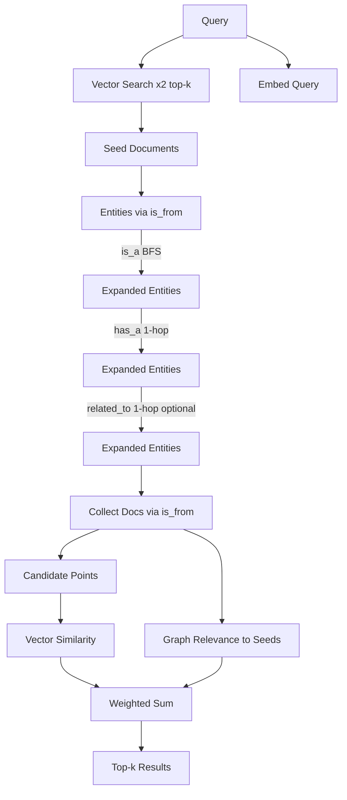
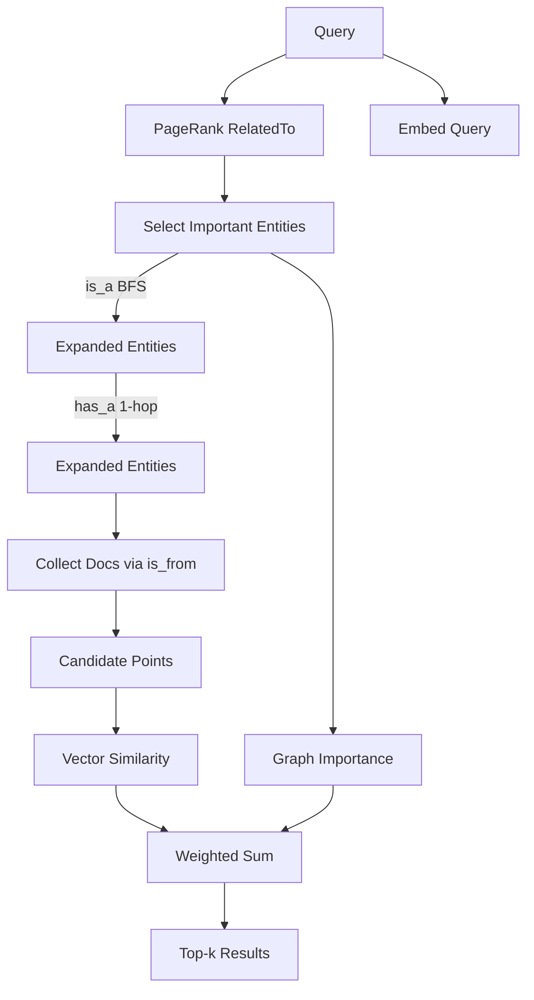
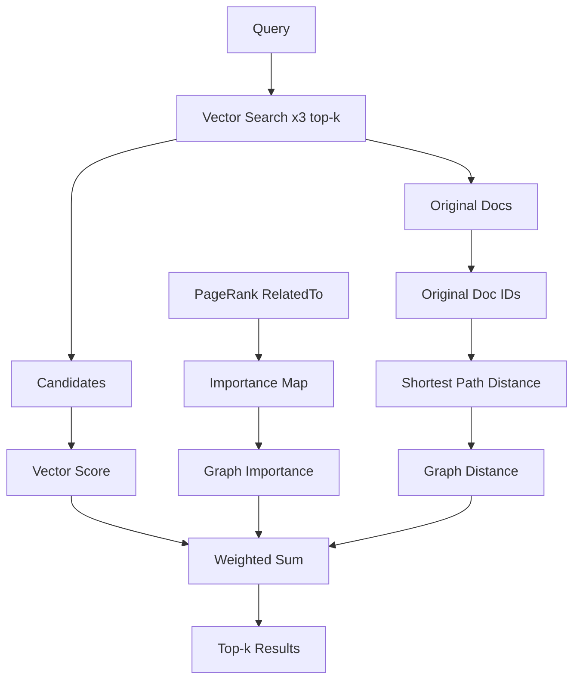
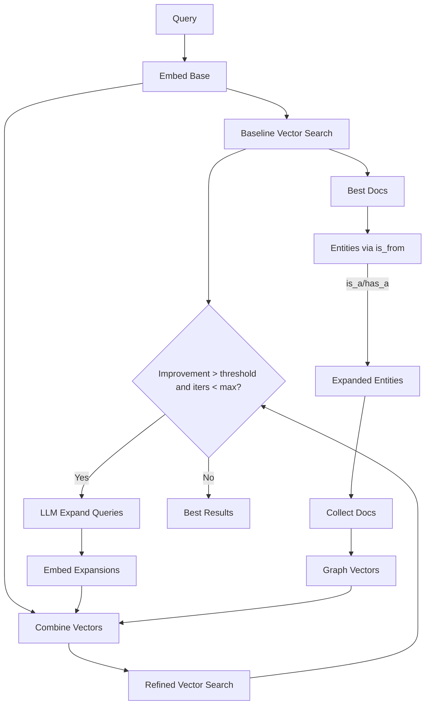
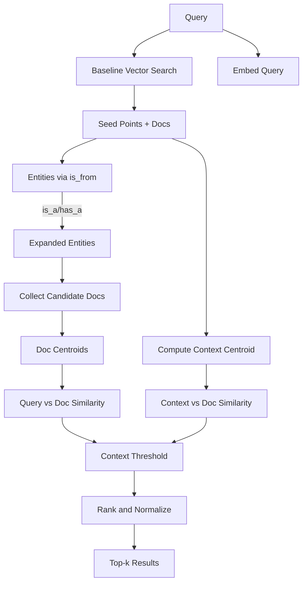

# DVS - DuckDB Vector Similarity Search

[](https://badge.fury.io/py/dvs-py)
[](https://www.python.org/downloads/)
[](https://opensource.org/licenses/MIT)

A Python library for vector similarity search powered by DuckDB and OpenAI embeddings.

## Features

- **Fast Vector Search**: Efficient similarity search using DuckDB's vector capabilities
- **OpenAI Integration**: Automatic embedding generation with OpenAI models
- **Caching**: Built-in embedding cache for improved performance
- **Simple API**: Easy-to-use Python interface
- **Flexible Storage**: Store documents with metadata

## Installation

```bash
pip install dvs-py
```

## Quick Start

### Basic Usage

```python
import asyncio
import tempfile
import openai_embeddings_model as oai_emb_model
from dvs import DVS

# Initialize DVS with a database file and model
dvs = DVS(
    tempfile.NamedTemporaryFile(suffix=".duckdb").name,
    model="text-embedding-3-small",
    model_settings=oai_emb_model.ModelSettings(dimensions=1536)
)

# Add documents
dvs.add("Apple announced new iPhone features with upgraded camera and A16 chip.")
dvs.add("Microsoft updated Azure with enhanced AI tools and security features.")

# Search
results = asyncio.run(dvs.search("What are the new iPhone features?"))
print(f"Found {len(results)} results")
for point, document, score in results:
    print(f"Score: {score:.3f} - {document.content[:100]}...")
```

### Advanced Configuration

```python
import asyncio
import pathlib
import diskcache
import openai
import openai_embeddings_model as oai_emb_model
from dvs import DVS

# Configure with custom cache and model settings
dvs = DVS(
    "./my_database.duckdb",
    model=oai_emb_model.OpenAIEmbeddingsModel(
        model="text-embedding-3-small",
        openai_client=openai.OpenAI(),
        cache=diskcache.Cache("./cache/embeddings.cache"),
    ),
    model_settings=oai_emb_model.ModelSettings(dimensions=1536),
    verbose=True
)

# Add documents with metadata
from dvs.types.document import Document

doc = Document.from_content(
    "Latest developments in artificial intelligence...",
    name="AI Research Paper",
    metadata={"author": "John Doe", "year": 2024}
)
dvs.add(doc)

# Search with more results
results = asyncio.run(dvs.search("artificial intelligence", top_k=10))
```

## Configuration

Set your OpenAI API key:

```bash
export OPENAI_API_KEY="your-api-key"
```

## Document Management

### Adding Documents

```python
# Add single document
dvs.add("Your document content here")

# Add multiple documents
documents = [
    "First document content",
    "Second document content",
    "Third document content"
]
dvs.add(documents)

# Add documents with metadata
from dvs.types.document import Document

docs = [
    Document.from_content("Content 1", name="Doc 1", metadata={"category": "tech"}),
    Document.from_content("Content 2", name="Doc 2", metadata={"category": "science"})
]
dvs.add(docs)
```

### Searching Documents

```python
# Basic search
results = asyncio.run(dvs.search("your query"))

# Search with more results
results = asyncio.run(dvs.search("your query", top_k=10))

# Search with embeddings included
results = asyncio.run(dvs.search("your query", with_embedding=True))
```

### Removing Documents

```python
# Get document ID from search results
results = asyncio.run(dvs.search("some query"))
doc_id = results[0][1].document_id

# Remove document
dvs.remove(doc_id)

# Remove multiple documents
dvs.remove([doc_id1, doc_id2, doc_id3])
```

## Development

Install development dependencies:

```bash
make install-all
```

Run tests:

```bash
make pytest
```

Format code:

```bash
make format-all
```

## License

This project is licensed under the MIT License. See the [LICENSE](LICENSE) file for details.

## Contributing

Contributions are welcome! Please feel free to submit a Pull Request.

## Support

If you encounter any issues or have questions, please [open an issue](https://github.com/allen2c/dvs/issues) on GitHub.

## GraphRAG Strategies (Overview)

Below is a concise overview of five GraphRAG strategies used in `dvs`. Each diagram mirrors the inline docstrings to aid quick understanding.

### Strategy 1: Vector Expansion

- Expand entities near seed docs via `is_from`, `is_a`, `has_a` (optional `related_to`).
- Combine vector similarity and graph relevance to rank.


```mermaid
flowchart TD
    Q[Query] --> VS[Vector Search x2 top-k]
    VS --> Seeds[Seed Documents]
    Seeds --> E0[Entities via is_from]
    E0 -->|is_a BFS| E1[Expanded Entities]
    E1 -->|has_a 1-hop| E2[Expanded Entities]
    E2 -->|related_to 1-hop optional| E3[Expanded Entities]
    E3 --> Docs[Collect Docs via is_from]
    Docs --> Cand[Candidate Points]
    Q --> Embed[Embed Query]
    Cand --> VSim[Vector Similarity]
    Docs --> GRel[Graph Relevance to Seeds]
    VSim --> Combine[Weighted Sum]
    GRel --> Combine
    Combine --> TopK[Top-k Results]
```

### Strategy 2: Graph-Guided

- Use PageRank(RelatedTo) to select salient entities; expand lightly.
- Combine vector similarity and graph importance.


```mermaid
flowchart TD
    Q[Query] --> PR[PageRank RelatedTo]
    PR --> Important[Select Important Entities]
    Important -->|is_a BFS| E1[Expanded Entities]
    E1 -->|has_a 1-hop| E2[Expanded Entities]
    E2 --> Docs[Collect Docs via is_from]
    Docs --> Cand[Candidate Points]
    Q --> Embed[Embed Query]
    Cand --> VSim[Vector Similarity]
    Important --> GImp[Graph Importance]
    VSim --> Combine[Weighted Sum]
    GImp --> Combine
    Combine --> TopK[Top-k Results]
```

### Strategy 3: Hybrid Scoring

- Start with vector candidates, then add PageRank-based importance and shortest-path distance.
- Weighted blend produces final ranking.


```mermaid
flowchart TD
    Q[Query] --> VS[Vector Search x3 top-k]
    VS --> Seeds[Original Docs]
    Seeds --> OIDs[Original Doc IDs]
    PR[PageRank RelatedTo] --> ImpMap[Importance Map]
    OIDs --> Dist[Shortest Path Distance]
    VS --> Cand[Candidates]
    Cand --> VScore[Vector Score]
    ImpMap --> GImp[Graph Importance]
    Dist --> GDist[Graph Distance]
    VScore --> Combine[Weighted Sum]
    GImp --> Combine
    GDist --> Combine
    Combine --> TopK[Top-k Results]
```

### Strategy 4: Iterative Refinement

- Iterate: LLM expand → embed → combine with graph → re-search until improvement small.


```mermaid
flowchart TD
    Q[Query] --> Embed0[Embed Base]
    Embed0 --> VS0[Baseline Vector Search]
    VS0 --> Loop{Improvement > threshold and iters < max?}
    Loop -- Yes --> LLM[LLM Expand Queries]
    LLM --> EmbedX[Embed Expansions]
    VS0 --> Seeds[Best Docs]
    Seeds --> Ent[Entities via is_from]
    Ent -->|is_a/has_a| E[Expanded Entities]
    E --> Docs[Collect Docs]
    Docs --> GVecs[Graph Vectors]
    Embed0 --> Cmp[Combine Vectors]
    EmbedX --> Cmp
    GVecs --> Cmp
    Cmp --> VS1[Refined Vector Search]
    VS1 --> Loop
    Loop -- No --> Out[Best Results]
```

### Strategy 5: Context-Aware

- Build centroid from seeds; expand via entities; filter candidates by context similarity.


```mermaid
flowchart TD
    Q[Query] --> VS[Baseline Vector Search]
    VS --> Seeds[Seed Points + Docs]
    Seeds --> Ctx[Compute Context Centroid]
    Seeds --> Ent[Entities via is_from]
    Ent -->|is_a/has_a| E[Expanded Entities]
    E --> Docs[Collect Candidate Docs]
    Docs --> Cent[Doc Centroids]
    Q --> Embed[Embed Query]
    Cent --> QSim[Query vs Doc Similarity]
    Ctx --> CSim[Context vs Doc Similarity]
    QSim --> Filter[Context Threshold]
    CSim --> Filter
    Filter --> Rank[Rank and Normalize]
    Rank --> TopK[Top-k Results]
```
